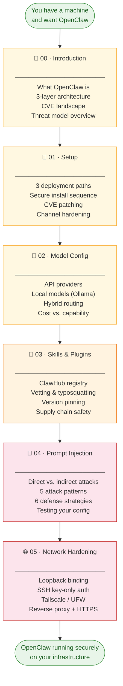

# OpenClaw Foundry

A practitioner's guide to building [OpenClaw](https://github.com/openclaw/openclaw) securely — with open source and proprietary frontier models.

---

## What this guide gives you

> **Modules 00–01** get you from zero to a running installation.
> **Modules 02–03** configure what the agent can do.
> **Modules 04–05** lock down how it does it.

---

## What is this

OpenClaw is an open-source personal AI agent with shell access, browser control, and messaging integrations. That power creates a large attack surface. This guide covers how to install, configure, and harden OpenClaw so you get the productivity benefits without leaving your infrastructure exposed.

Each module is self-contained and can be read independently, but the recommended path is sequential.

---

## Modules

| # | Module | Status | Description |
|---|--------|--------|-------------|
| 00 | [Introduction](00-introduction/) | ✅ | What OpenClaw is, architecture, security landscape |
| 01 | [Setup](01-setup/) | ✅ | Deployment paths, install, security hardening |
| 02 | [Model Config](02-model-config/) | ✅ | Provider setup, local models, hybrid routing |
| 03 | [Skills & Plugins](03-skills-plugins/) | ✅ | ClawHub registry, vetting third-party skills |
| 04 | [Prompt Injection](04-prompt-injection/) | ✅ | Threat model, defenses, testing strategies |
| 05 | [Network Hardening](05-network-hardening/) | ✅ | VPS lockdown, Tailscale, firewall rules |

---

## Prerequisites

- Familiarity with the command line
- A machine or VPS to run OpenClaw on (see [01-setup](01-setup/))
- An API key from at least one model provider, or Ollama for local inference

---

## License

This work is licensed under the [MIT License](LICENSE).
